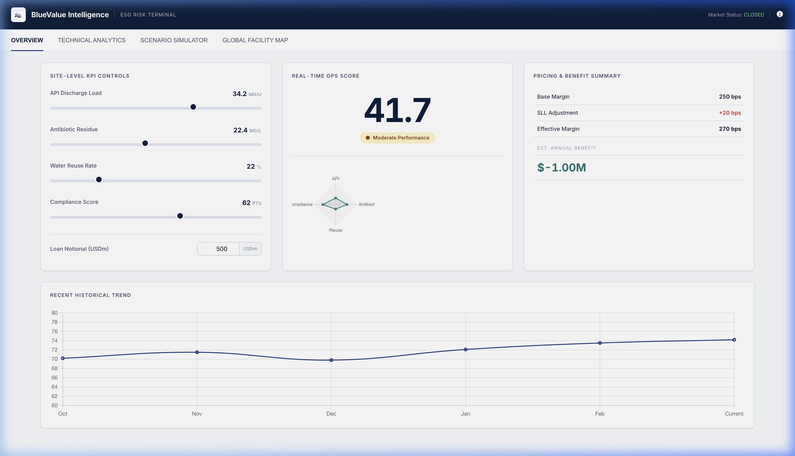
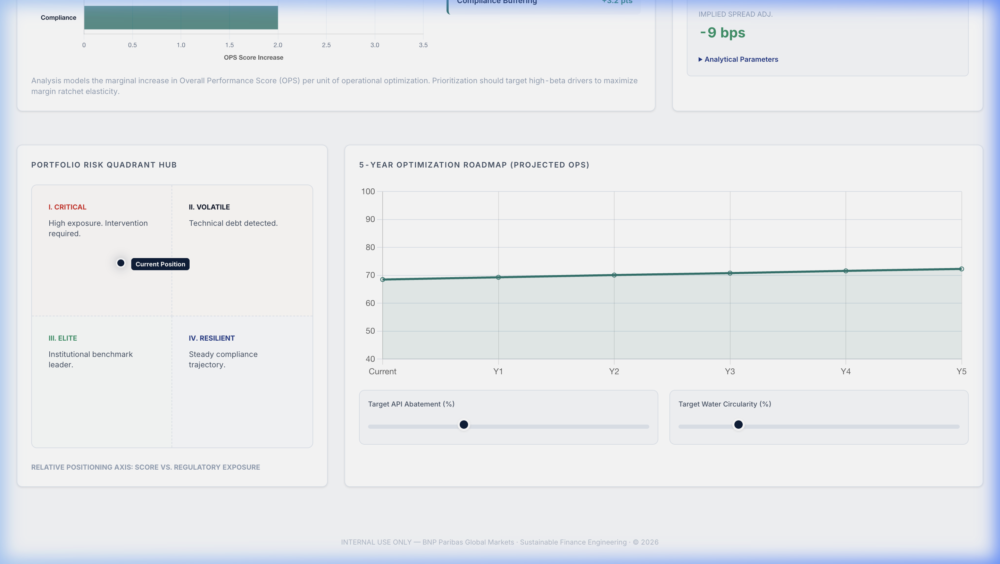
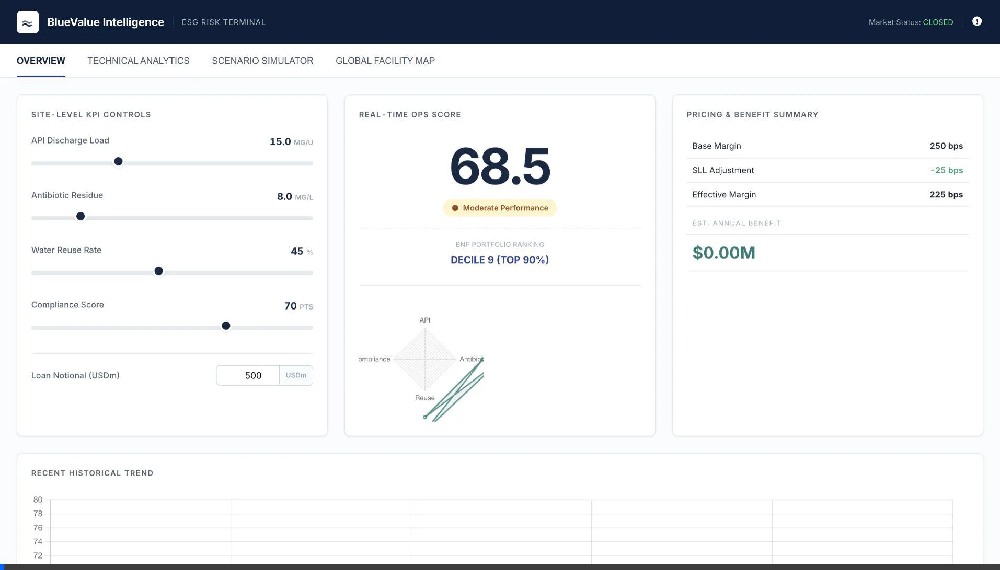
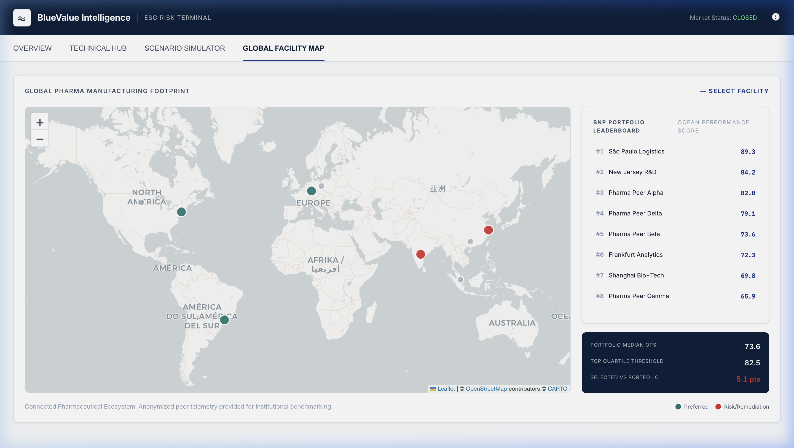

# BlueValue Intelligence: Institutional ESG Risk Terminal

## Executive Summary
**BlueValue Intelligence** is a high-fidelity, institutional-grade analytical terminal designed for **Sustainable Finance Engineering** and **Sustainable Finance Engineering (SFE)** teams. It provides a cockpit for monitoring wastewater risk, simulating sustainability-linked loan (SLL) margin adjustments, and forensic auditing of facility-level ESG performance.

Born from the **BNP Paribas Structured Finance Hackathon**, this platform transforms raw wastewater data into actionable financial intelligence using the proprietary **Ocean Performance Score (OPS)** engine.

---

## 🏛️ Core Feature Pillars

### 1. Executive Intelligence Overview
A high-density dashboard for monitoring real-time OPS telemetry across a facility portfolio.
- **Interactive OPS Sliders**: Real-time manipulation of KPI inputs (API, AB, Reuse, Compliance) with instant impact on loan pricing.
- **Financial Benefit Engine**: Dynamic calculation of SLL margin ratchet impact and annualized interest savings.
- **Portfolio Intelligence**: Comparative decile ranking against the broader BNP Paribas portfolio.

### 2. Technical Intelligence Hub (Forensic Deep-Dive)
A deep-audit workspace for technical risk officers and credit committees.
- **Forensic KPI Decomposition**: Granular audit view comparing internal metrics against portfolio medians and peer quartiles.
- **Marginal Abatement Analysis**: Tornado charts visualizing "OPS Beta"—the sensitivity of the score to specific operational levers.
- **Portfolio Risk Quadrant**: Dynamic 2x2 positioning matrix mapping facilities by **Regulatory Exposure vs. Operational Scoring**.
- **5-Year Optimization Roadmap**: Predictive forecasting for performance trajectories based on target abatement rates.

### 3. Scenario Intelligence Lab (Strategic Cockpit)
A decision-support cockpit for simulating capital expenditure (CAPEX) impact and regulatory shocks.
- **Visual Comparison Bridge**: Side-by-side telemetry of Baseline vs. Simulated performance.
- **Economic Sensitivity Lab**: Modeling probability-weighted spread adjustments and NPV outcomes.
- **Strategic Advisory Lab**: Automated expert reporting providing summarized findings on break-even periods and project viability.

### 4. Global Facility Map
High-resolution geographic visualization of facility performance.
- **Spatial Intelligence**: Leaflet.js-powered map with color-coded risk markers.
- **Site Selection Telemetry**: Direct injection of site data into the analytical engine from map interactions.

---

## 🛠️ Technical Architecture
- **Engine**: Vanilla JavaScript (tabular-nums, functional optimization).
- **Visualization**: Chart.js for high-density financial charting.
- **Mapping**: Leaflet.js for spatial telemetry.
- **Design System**: Monochrome Navy/Teal institutional palette, `Inter` typography, glassmorphic UI components.

## 🚀 Deployment & Usage
Simply open `index.html` in a modern browser. No build steps required for the core terminal.

---
*INTERNAL USE ONLY — BNP Paribas Global Markets · Sustainable Finance Engineering · © 2026*
